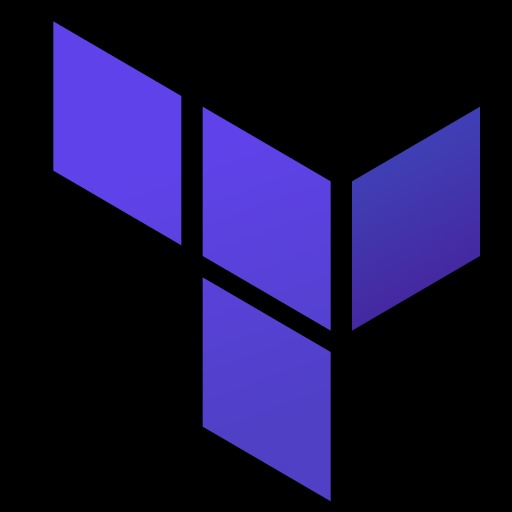

<!-- Header Banner -->

  

  

<!-- Top Banner GIF -->

  

<!-- Two-Column Layout -->
<table>
<tr>
<td width="30%" align="center">

<!-- Left Side GIF -->

</td>
<td width="70%" valign="top">

<!-- Right Side Intro -->
I am a **Cloud Security & DevOps Engineer** with hands-on expertise in designing and securing modern cloud infrastructures using **AWS, Terraform, and Kubernetes**.  
I specialize in building **compliance-driven CI/CD pipelines** with **Jenkins, Docker, and ArgoCD**, integrating security gates through **SonarQube, Trivy, and OWASP Dependency-Check** to ensure code quality and vulnerability management.  

My experience spans across implementing **Infrastructure as Code (IaC)** for scalable and resilient architectures, deploying containerized applications to **Amazon EKS**, and automating threat detection and remediation with AWS services like **GuardDuty, Config, CloudTrail, and Security Hub**.  

With a strong focus on **real-time monitoring and observability**, I utilize **Prometheus and Grafana** to achieve proactive performance insights.  
I bring a balance of **DevOps efficiency and robust cloud security**, delivering enterprise-grade solutions that enhance agility, compliance, and resilience.

</td>
</tr>
</table>

 

<!-- Tech Stack Icons -->

  
  
  
  
  
  
  

